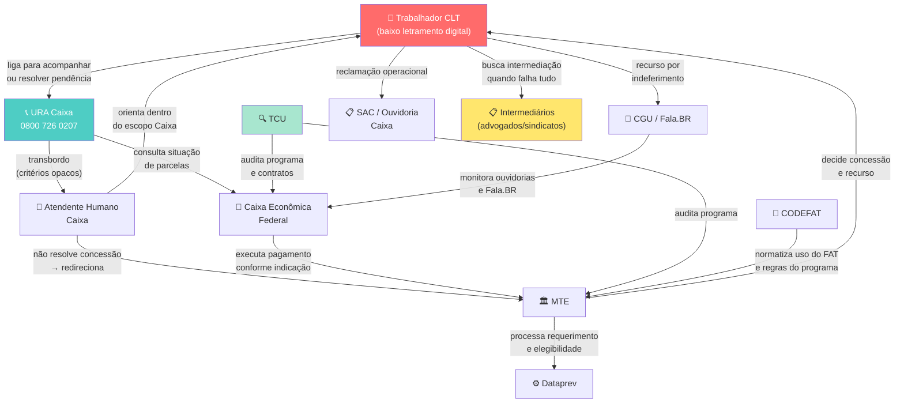

# Mapa de Atores — Atendimento ao Seguro-Desemprego pela URA da Caixa

> **Metodologia:** Aula 02 — Diagnóstico de Serviço Público (Passos 0–5: Propósito → Lista → Mendelow → Incentivos → Relações → Atores-chave)
> **Insumo principal:** B_relatorio_assistente_v3.md
> **Versão:** 1.0

---

## Decisões do Grill — Registro de Escopo

Durante a sessão `/grill-me` (C_grill_transcript.md), as seguintes decisões moldaram as escolhas deste mapa:

| Pergunta | Opção escolhida | Justificativa registrada |
|---|---|---|
| **P1 — Escopo da jornada** | C — Escopo misto | Jornada completa no mapa, com destaque para os momentos de interação com a URA. O v3 já cobria a jornada completa; descartar isso desperdiçaria o trabalho produzido. |
| **P2 — Produto final** | A — O mapa em si | Produzir o mapa diretamente, usando o v3 como insumo, é mais útil do que produzir um prompt que produza o mapa. |
| **P3 — Uso final** | C — Projeto profissional/aplicado | Pontos abertos tratados como inferência marcada, para que o mapa seja utilizável na prática. |
| **P4 — Propósito (Passo 0)** | A — Endereçar failure demand | Propósito focado em reduzir recontato e failure demand no canal 0800, o mais acionável dado o material do v3. |
| **P5 — Cidadão central** | D — CLT com exclusão digital | Trabalhador formal CLT demitido sem justa causa, **com baixo letramento digital**, para quem o canal telefônico é a via principal ou única. Esse sub-grupo é o centro do problema de failure demand — não o trabalhador digital fluente que resolve pelo app. Escolha deliberada: excluir o perfil digital-fluente do núcleo do mapa para manter o foco no propósito. |
| **P6 — Órgãos de controle** | D — Apenas TCU e CGU | Incluir apenas atores com interface comprovada com este serviço. TCU já auditou o programa (citado no v3); CGU opera o Fala.BR, canal de reclamação já presente no v3. Procon e MPT excluídos por não terem evidência de interface documentada com a URA especificamente. |
| **P7 — Intermediários** | B — Periféricos com incentivo paradoxal explícito | Sindicatos e advogados incluídos como atores que lucram com a complexidade e resistem à simplificação — força relevante para endereçar failure demand. Presença no fluxo regular do 0800 não confirmada; posicionados no fluxo de recurso por indeferimento. |
| **P8 — Formato** | D — Markdown com Mermaid | Consistente com o material existente; diagrama de relações renderiza visualmente em ferramentas compatíveis. |

---

## Passo 0 — Propósito

**Problema central:** Trabalhadores com baixo letramento digital ligam para o 0800 726 0207 como única via de acesso ao Seguro-Desemprego. Quando o primeiro contato não resolve — seja por limite de escopo da URA, seja por transbordo para humano com competência restrita — o trabalhador retorna múltiplas vezes, gerando **failure demand** sistêmica.

**Propósito deste mapa:** Endereçar a alta taxa de recontato e a failure demand no canal 0800, identificando quais atores sustentam as fricções hoje e quais têm alavanca para mudança.

**Cidadão central:** Trabalhador formal CLT demitido sem justa causa, com baixo letramento digital, para quem o canal telefônico é a via principal ou única de acompanhamento de parcelas e resolução de pendências.

---

## Passo 1 — Lista de Atores

### 1.1 Usuários Diretos

| Ator | Papel na jornada | Pontos de contato | Dores e limitações |
|---|---|---|---|
| **Trabalhador CLT com baixo letramento digital** | Beneficiário; solicita, acompanha e tenta resolver pendências pelo 0800; recorre em caso de indeferimento | 0800 726 0207 (URA e humano), agências Caixa, unidades MTE, SRTE | Não consegue usar CTD, app ou portal; depende de documentação do empregador; não decide concessão; sofre failure demand quando o primeiro contato não resolve |

### 1.2 Operadores (Linha de Frente)

| Ator | Papel na jornada | Pontos de contato | Dores e limitações |
|---|---|---|---|
| **URA da Caixa (sistema automatizado)** | Triagem inicial; consulta de parcelas; coleta de dados (NIS/PIS); roteamento para serviços ou transbordo para humano | 0800 726 0207, 24h | Escopo limitado a acompanhamento de parcelas da Caixa; não acessa sistemas do MTE; critérios de transbordo para humano não documentados publicamente |
| **Atendente humano da Caixa** | Atende quando a URA não resolve; orienta sobre situação operacional de parcelas | 0800 726 0207 (seg–sex 8h–21h; sáb 10h–16h) | Não decide concessão nem elegibilidade; pendências de concessão dependem do MTE; roteiro, escopo e SLA não disponíveis em fontes públicas *(ponto aberto)* |
| **Agente do MTE / unidade de atendimento** | Processa requerimentos presenciais; orienta sobre elegibilidade; integra fluxo de recurso | Unidades MTE, SRTE, postos autorizados | Capacidade variável por região; trabalhador com baixo letramento digital pode ter dificuldade de acesso presencial |

### 1.3 Gestores e Decisores

| Ator | Papel na jornada | Interface com o cidadão | Observação |
|---|---|---|---|
| **MTE — Ministério do Trabalho e Emprego** | Operacionaliza a concessão conforme Lei 7.998/1990 e normas CODEFAT; decide elegibilidade; processa recursos | Portal Emprega Brasil, CTD, unidades de atendimento, SRTE | Não confundir com único definidor de regras — elegibilidade decorre de lei; MTE não opera o canal 0800 |
| **Caixa Econômica Federal (gestão do canal)** | Define escopo, roteiro e SLA da URA e do atendimento humano; opera o pagamento | 0800 726 0207, apps, portais, SAC, Ouvidoria, agências | Não decide concessão nem elegibilidade; gap estrutural entre competência Caixa e demandas de concessão que o trabalhador traz ao canal |
| **CODEFAT — Conselho Deliberativo do FAT** | Delibera sobre uso do FAT; normatiza aspectos operacionais e financeiros do programa | Resoluções e normas que afetam o programa indiretamente | Ator normativo; sem interface direta com o cidadão no canal 0800 |

### 1.4 Órgãos de Controle

| Ator | Papel | Interface com o serviço | Observação |
|---|---|---|---|
| **TCU — Tribunal de Contas da União** | Audita o programa e os contratos da Caixa; pode recomendar ou determinar redesenho | Auditorias, acórdãos, relatórios (ex: dados de beneficiários 2022/2024 citados no v3) | Alto poder; pode viabilizar ou bloquear mudanças estruturais; historicamente ativo no monitoramento do programa |
| **CGU — Controladoria-Geral da União** | Opera o Fala.BR (canal de reclamação federal); monitora ouvidorias e transparência | Fala.BR / Ouvidoria federal — canal de reclamação por concessão, recurso ou elegibilidade fora do escopo da Caixa | Registros de reclamação são inteligência diagnóstica sobre failure demand |

### 1.5 Atores Sistêmicos e de Infraestrutura

| Ator | Papel | Interface com o cidadão | Observação |
|---|---|---|---|
| **Dataprev** | Desenvolve e opera sistemas de processamento dos requerimentos do Seguro-Desemprego | Infraestrutura de backend; sem interface direta | Mencionado em documentos do TCU; composição exata dos sistemas pendente *(ponto aberto)* |
| **INSS** | Base consultada para verificação de acúmulo de benefício previdenciário | Cruzamento sistêmico; sem interface direta no fluxo 0800 | Ator sistêmico periférico |
| **eSocial / RAIS** | Bases de dados trabalhistas usadas em cruzamentos de elegibilidade | Sem interface direta com o cidadão | Bases de dados, não atores decisores |

### 1.6 Intermediários (com incentivo paradoxal)

| Ator | Papel | Incentivo | Observação |
|---|---|---|---|
| **Sindicatos** | Podem orientar trabalhadores sobre recurso; atuam em acordos coletivos e assistência voluntária | Defender direitos dos trabalhadores — mas também têm interesse em manter relevância como intermediários necessários | Presença no fluxo regular do 0800 não confirmada; atores do fluxo de recurso por indeferimento |
| **Advogados trabalhistas** | Assessoram em litígios e recursos | **Incentivo paradoxal:** lucram com a complexidade do sistema; um serviço simples e resolutivo reduz a demanda por seus serviços | Atores periféricos; sua presença indica falha no acesso direto ao serviço |

### 1.7 Vozes Críticas

| Ator | Papel | Relevância para o diagnóstico |
|---|---|---|
| **Ouvidoria da Caixa** | Segunda instância de reclamação sobre serviços da Caixa (0800 725 7474) | Registros são inteligência sobre failure demand no canal telefônico |
| **SAC da Caixa** | Reclamações, sugestões, cancelamentos (0800 726 0101) | Padrões de ligação expõem os 3 principais motivos de recontato |
| **Conselhos de usuários (Lei 13.460/2017)** | Instâncias formais de participação e controle social do serviço | Podem validar ou contestar diagnóstico da gestão |

---

## Passo 2 — Matriz de Mendelow (Poder × Interesse)

> Poder = capacidade de bloquear ou viabilizar mudanças no serviço.
> Interesse = grau de envolvimento direto com os resultados do canal 0800.

|  | **Baixo Interesse** | **Alto Interesse** |
|---|---|---|
| **Alto Poder** | **Manter satisfeito:** TCU (pode bloquear redesenho via auditoria), CODEFAT (normatiza o programa) | **Gerenciar de perto:** Caixa (opera o canal), MTE (decide concessão), CGU (Fala.BR — inteligência de reclamação) |
| **Baixo Poder** | **Monitorar:** Dataprev, INSS, eSocial/RAIS, advogados trabalhistas | **Manter informado:** Trabalhador CLT com baixo letramento digital, atendente humano da Caixa, agente MTE, sindicatos, conselhos de usuários |

> **Atenção:** O trabalhador está em "Baixo Poder / Alto Interesse" — é quem mais sofre as consequências, mas tem menor capacidade de forçar mudança. Essa assimetria é uma armadilha clássica: o serviço é otimizado para quem tem poder de reclamar formalmente, não para quem mais precisa dele.

---

## Passo 3 — Incentivos e Resistências

### Atores de alto poder/interesse

**Caixa Econômica Federal**
- **Ganha hoje com o serviço atual:** Opera um canal com escopo limitado (acompanhamento de parcelas), o que reduz responsabilidade operacional e evita entrar em disputas com o MTE sobre concessão.
- **Perderia com a transformação:** Custo de redesenho da URA, renegociação de escopo com o MTE, exposição a mais reclamações se o canal passar a resolver mais.
- **Alavanca para mudança:** Redução de volume de chamadas (failure demand gera custo operacional real); melhora de NPS e indicadores de SAC/Ouvidoria; pressão do TCU via auditoria.

**MTE — Ministério do Trabalho e Emprego**
- **Ganha hoje:** Canal 0800 da Caixa absorve parte da demanda de acompanhamento, aliviando as unidades presenciais do MTE.
- **Perderia:** Se o 0800 resolver mais, pode aumentar a demanda por resolução de pendências de concessão que hoje ficam represadas — expondo gargalos do MTE.
- **Alavanca:** Redução de judicialização (cada recurso não resolvido vira potencial ação judicial); pressão do TCU e CODEFAT por resultados do programa.

**CGU / Fala.BR**
- **Ganha hoje:** Registros de reclamação geram dados de failure demand que alimentam diagnósticos e relatórios.
- **Perderia:** Volume de reclamações é indicador de relevância institucional; redução drástica pode parecer perda de missão.
- **Alavanca:** Mandato legal de melhoria contínua dos serviços públicos; interesse em mostrar que a plataforma gera mudança real.

**TCU**
- **Ganha hoje:** Baixo interesse na rotina; alto poder se decidir auditar.
- **Perderia:** Nada diretamente com a melhoria do serviço.
- **Alavanca:** Auditoria focada em failure demand do canal 0800 pode ser o gatilho que força redesenho — o TCU já auditou o programa (dados do v3).

### Atores com incentivo paradoxal

**Advogados trabalhistas e sindicatos**
- Lucram ou ganham relevância com a complexidade do sistema.
- Um canal 0800 resolutivo que explique claramente os direitos e os próximos passos reduz a demanda por intermediação.
- **Resistência esperada:** discreta, mas real — podem questionar redesenhos que "simplificam demais" ou "substituem o aconselhamento humano especializado".

### Fricções estruturais identificadas

1. **Gap de competência Caixa/MTE:** A URA opera no espaço da Caixa (pagamento), mas o trabalhador liga com demandas de concessão (MTE). O canal não foi desenhado para resolver o problema real do cidadão — foi desenhado para o organograma do Estado. Viola o **Princípio #5 de Lou Downe: Agnosticismo Organizacional**.

2. **Horário restrito do atendimento humano:** Seg–sex 8h–21h e sáb 10h–16h. Trabalhador demitido pode estar em novo emprego informal; o horário comercial exclui quem mais precisa.

3. **Critérios de transbordo opacos:** Não há documentação pública sobre quando e como a URA transfere para humano. O trabalhador não sabe quando vai conseguir falar com alguém — **beco sem saída** (viola Princípio #8).

4. **Identificação por NIS/PIS não confirmada:** O processo de autenticação na URA não está documentado publicamente. Se exige dados que o trabalhador não tem em mãos, gera abandono imediato.

---

## Passo 4 — Mapa de Relações

**Legenda de leitura:**
- **Vermelho:** cidadão central — quem sofre a failure demand
- **Verde-água:** ponto de entrada do canal analisado
- **Amarelo:** intermediários com incentivo paradoxal
- **Verde claro:** ator de controle com alto poder latente

**Atores-ponte críticos:** MTE e Caixa são os dois nós com maior densidade de conexões — e o gap entre eles (linha "não resolve concessão → redireciona") é onde a failure demand se materializa.

---

## Passo 5 — Atores-Chave e Hipóteses de Diagnóstico

### Os 6 atores que bloqueiam ou viabilizam a mudança

| Ator | Posição Mendelow | Papel no bloqueio/viabilização |
|---|---|---|
| **Caixa Econômica Federal** | Alto Poder / Alto Interesse | Define escopo da URA; sem redesenho interno, nada muda no canal |
| **MTE** | Alto Poder / Alto Interesse | Decide concessão; enquanto o gap Caixa/MTE não for endereçado, o 0800 não pode resolver o problema real do trabalhador |
| **TCU** | Alto Poder / Baixo Interesse (rotina) | Uma auditoria focada em failure demand do 0800 pode ser o gatilho externo que força ambas as instituições a agir |
| **CGU / Fala.BR** | Alto Poder / Alto Interesse | Tem os dados de reclamação que provam o volume de failure demand — inteligência diagnóstica subutilizada |
| **Atendente humano da Caixa** | Baixo Poder / Alto Interesse | Conhecimento prático mais rico sobre o que o trabalhador realmente quer; ignorado no diagnóstico oficial |
| **Advogados/sindicatos** | Baixo Poder / Baixo Interesse (no 0800) | Resistência discreta à simplificação; monitorar para não bloquear iniciativas de melhoria |

### Hipóteses sobre como os atores mantêm as fricções hoje

1. **A Caixa não tem incentivo para ampliar o escopo da URA** — resolver mais significa expor o gap com o MTE e assumir mais responsabilidade operacional sem ganho institucional claro.

2. **O MTE não tem incentivo para integrar seus sistemas ao 0800 da Caixa** — a demanda que chega ao canal telefônico não aparece nas métricas do MTE; é um custo invisível transferido para o trabalhador e para a Caixa.

3. **A failure demand é invisível porque não é medida** — não há dado público sobre volume de recontatos, motivos de ligação ou taxa de resolução no 0800 para Seguro-Desemprego. Sem métrica, não há pressão para mudar.

4. **O trabalhador com baixo letramento digital não tem voz institucional** — está em "Baixo Poder / Alto Interesse" e não aciona os canais formais de reclamação (SAC, Fala.BR) com a mesma frequência que trabalhadores mais letrados digitalmente. Sua failure demand é subnotificada.

---

## Lacunas Remanescentes (Do Mapa à Ação)

| Lacuna | Tipo | O que precisa para fechar |
|---|---|---|
| Volume real de recontatos no 0800 para SD | Compreensão | Acesso a relatórios internos da Caixa ou pesquisa de campo |
| Critérios de transbordo URA → humano | Compreensão | Documentação interna da Caixa (não disponível publicamente) |
| Competência efetiva e SLA do atendente humano | Compreensão | Roteiro interno e métricas de atendimento da Caixa |
| Dados de reclamação CGU/Fala.BR desagregados por serviço | Expectativa | Consulta à base pública do Fala.BR filtrada por Seguro-Desemprego/Caixa |
| Arquitetura sistêmica Dataprev/MTE | Compreensão | Documentos técnicos do TCU ou do próprio MTE/Dataprev |

> **Regra de ouro (aula02):** "Se vai escutar, tem que estar pronto pra agir — ou explicar por que não vai agir." As lacunas acima são o próximo passo de pesquisa antes de qualquer proposta de redesenho do canal.
