```mermaid
flowchart TD

    %% ══════════════════════════════════════════════
    %% ATORES
    %% ══════════════════════════════════════════════
    EMP(["🏢 Empregador"])
    CID(["👷 Cidadão\nbaixo letramento digital"])
    MTE_ORG(["🏛️ MTE / Gov.br\n158 · CTPS Digital · SINE-Fácil"])

    %% ══════════════════════════════════════════════
    %% E0 — PRÉ-JORNADA
    %% ══════════════════════════════════════════════
    EMPWEB[/"Empregador Web\n(ICP-Brasil) [N]"/]
    GOVBR[/"Gov.br / CTPS Digital\nRequerimento SD [N]"/]

    F0(["⚡ F0\nDados errados do empregador\nbloqueiam habilitação automática [N]"])
    F21(["⚡ F21\nBloqueio de conta gov.br\nimpede requerimento [N]"])
    F22(["⚡ F22\nPrazo 7–120 dias correndo;\ncidadão pode perder o prazo [N]"])

    EMP -->|"transmite dados\nda rescisão [N]"| EMPWEB
    EMPWEB -->|"alimenta base\nde elegibilidade"| ELEG
    EMPWEB -->|"dado errado →"| F0
    F0 -->|"bloqueia habilitação\nautomática →"| BLOQ_HAB(["🔴 Habilitação\nbloqueada"])

    CID -->|"requere benefício\n[N]"| GOVBR
    GOVBR -->|"falha de acesso →"| F21
    F21 -->|"impede requerimento →"| BLOQ_REQ(["🔴 Requerimento\nbloqueado"])
    GOVBR -->|"requerimento\nok →"| F22
    F22 -->|"prazo vence →"| PERDA_PRAZO(["🔴 Perda do\ndireito ao SD"])

    %% ══════════════════════════════════════════════
    %% E1 — DECIDE LIGAR
    %% ══════════════════════════════════════════════
    DEC{"Cidadão decide\ncomo resolver\na demanda"}
    F18(["⚡ F18\nCanal errado: 0800 Caixa\npara demanda de concessão\nque exige 158 / MTE [N]"])

    CID -->|"busca resolução\ndo benefício"| DEC
    DEC -->|"acessa canal\ncorreto [O]"| MTE_ORG
    DEC -->|"liga para\n0800-726-0207"| F18
    F18 -->|"entra no canal\nde pagamento com\ndemanda de concessão"| URA

    %% ══════════════════════════════════════════════
    %% E2 — NAVEGA MENU (⚠ Hipótese [I])
    %% ══════════════════════════════════════════════
    URA["📞 URA Caixa\n0800-726-0207\n24h [O] ⚠ conteúdo [I]"]
    F1(["〰 F1\nLoop de menu sem\nsaída para atendente [A]"])
    F2(["〰 F2\nMenu confuso:\nterminologia / velocidade\n/ timeout [A/I]"])
    F3(["〰 F3\nEncerramento\nabrupto [A]"])

    URA -->|"apresenta menu\nDTMF [I]"| MENU_OK{"Cidadão identifica\nopção SD?"}
    MENU_OK -->|"não localiza\nopção"| F1
    MENU_OK -->|"timeout /\nnão compreende"| F2
    MENU_OK -->|"sim →"| AUTH
    F1 -->|"sem saída →"| ABAND
    F2 -->|"desiste →"| ABAND
    URA -->|"desconecta\nsem aviso"| F3
    F3 -->|"retrabalho:\ncidadão liga novamente →"| CID

    %% ══════════════════════════════════════════════
    %% E3 — AUTENTICA (⚠ Hipótese [I])
    %% ══════════════════════════════════════════════
    AUTH{"Autenticação URA\n⚠ mecanismo em aberto [I]"}
    F4b(["〰 F4b\nFalha de autenticação\ntelefônica [I]"])
    F4a(["⚡ F4a\nInconsistência cadastral\nbloqueio de habilitação [N]"])

    AUTH -->|"dado(s) divergente(s)\n(mecanismo URA em aberto)"| F4b
    AUTH -->|"inconsistência\nCNIS / Empregador Web"| F4a
    AUTH -->|"autenticado →"| SUBMENU
    F4b -->|"bloqueia acesso →"| ABAND
    F4a -->|"bloqueia habilitação;\ntrabalhador pode recorrer →"| MTE_ORG

    %% ══════════════════════════════════════════════
    %% E4 — NAVEGA SUBMENU (⚠ Hipótese [I])
    %% ══════════════════════════════════════════════
    SUBMENU{"Submenu SD\n⚠ conteúdo em aberto [I]"}
    F6(["〰 F6\nSistema indisponível\nem pico de demanda [A]"])
    F7(["〰 F7\nBackend indisponível;\nerro genérico sem saída [I]"])
    F8(["〰 F8\nStatus divergente entre\nURA, App e portal [A]"])

    SUBMENU -->|"sistema fora\ndo ar"| F6
    SUBMENU -->|"backend\nindisponível"| F7
    SUBMENU -->|"informação\ndesatualizada"| F8
    F6 -->|"sem alternativa →"| ABAND
    F7 -->|"sem alternativa →"| ABAND
    F8 -->|"gera recontato →"| CID

    SUBMENU -->|"informação\ndisponível"| RESOL
    SUBMENU -->|"demanda não\nresolvida pela URA"| FILA
    SUBMENU -->|"orienta outro\ncanal"| REDIR

    %% ══════════════════════════════════════════════
    %% DESFECHO AUTOMÁTICO
    %% ══════════════════════════════════════════════
    RESOL(["✅ Resolução automatizada\nStatus / data de crédito\nfornecidos pela URA [I]"])
    REDIR(["↩️ Redirecionamento\npara App / gov.br / 158 [I]"])
    ABAND(["❌ Abandono\nsem resolução"])

    RESOL -->|"chamada\nencerrada"| ENC
    REDIR -->|"cidadão vai para\noutro canal"| MTE_ORG
    ABAND -->|"chamada\nencerrada"| ENC

    %% ══════════════════════════════════════════════
    %% E4–E5 — PÓS-SUBMENU: ACESSO À CONTA DIGITAL
    %% ══════════════════════════════════════════════
    F5(["⚡ F5\nTrabalhador não consegue acessar/\nmovimentar conta digital CAIXA Tem [N/A]"])
    F16(["⚡ F16\nQueda de chamada por sinal precário;\nretrabalho total [I]"])

    RESOL -->|"trabalhador direciona\npara App"| F5
    F5 -->|"conta inacessível;\nsem saque →"| ABAND
    URA -.->|"chamada"| F16
    F16 -->|"perda total\nda ligação →"| CID

    %% ══════════════════════════════════════════════
    %% E5–E6 — FILA E ATENDIMENTO HUMANO (⚠ [I])
    %% ══════════════════════════════════════════════
    FILA["E5 — Fila para\natendente humano ⚠ [I]"]
    F11(["〰 F11\nFila longa;\nsem TME oficial [A]"])
    F15(["〰 F15\nDificuldade de idosos /\nbaixo letramento no aguardo [A/I]"])
    ATN["🧑 Atendente Humano Caixa\nseg–sex 8h–21h · sáb 10h–16h [O]\nEscopo: consulta / pagamento"]
    F9(["⚡ F9\nAtendente não decide concessão;\nredireciona para MTE\nsem prazo definido [N/O]"])
    F13(["〰 F13\nAusência de protocolo\nescrito automático [A]"])
    F14(["〰 F14\nCanal PcD auditiva/fala:\nescopo para SD não verificado [O/I]"])

    FILA -->|"espera longa"| F11
    FILA -->|"timeout /\ndesconexão"| F15
    F11 -->|"cidadão aguarda\nou abandona"| ATN
    F15 -->|"desiste →"| ABAND
    ATN -->|"demanda de\nconcessão →"| F9
    ATN -->|"sem protocolo\nescrito →"| F13
    ATN -->|"cidadão PcD auditiva/fala\nvia canal alternativo"| F14
    ATN -->|"atendimento\nconcluído →"| ENC
    F9 -->|"redireciona cidadão\npara canal correto"| MTE_ORG
    F13 -->|"cidadão sem rastro;\nrecontato provável →"| CID
    F14 -->|"escopo SD não validado;\nmantém no fluxo →"| ATN

    %% ══════════════════════════════════════════════
    %% E7 — ENCERRAMENTO E FAIL POINTS PÓS-JORNADA
    %% ══════════════════════════════════════════════
    ENC(["📵 Chamada encerrada"])
    F10(["⚡ F10\nNotificação digital não acessada;\npresumida válida após 5 dias [N]"])
    F17(["⚡ F17\nRecurso de 120 dias desconhecido;\nexige conta gov.br Prata/Ouro [N]"])
    F19(["⚡ F19\nParcela devolvida ao FAT após 67 dias;\nreemissão em até 2 anos\n(canal em aberto) [N]"])
    F20(["⚡ F20\nContestação de recebimento de parcela\ndesconhecida pelo trabalhador [N]"])
    F23(["⚡ F23\nSuspensão por recusa de ação\nde recolocação — desconhecimento\nda causa [N]"])
    F24(["⚡ F24\nTrabalhador não sabe se está abrangido\npor prolongamento excepcional\nde parcelas [N]"])

    ENC -->|"notificação não\nchega / não é lida"| F10
    ENC -->|"indeferimento\nnão contestado"| F17
    ENC -->|"parcela não\nsacada"| F19
    ENC -->|"fraude / erro\nbancário desconhecido"| F20
    ENC -->|"recusa de recolocação\ndesconhecida"| F23
    ENC -->|"prolongamento\nexcepcional aplicável?"| F24
    F10 -->|"cidadão perde\nprazo de exigência →"| PERDA_PRAZO
    F17 -->|"120 dias vence;\nperde recurso →"| PERDA_PRAZO
    F19 -->|"parcela devolvida;\ncidadão solicita\nreemissão via →"| MTE_ORG
    F20 -->|"sem saída;\ncontestação possível →"| MTE_ORG
    F23 -->|"benefício\nsuspenso"| PERDA_PRAZO
    F24 -->|"direito não\nexercido"| PERDA_PRAZO

    %% ══════════════════════════════════════════════
    %% SISTEMAS DE SUPORTE (BACKSTAGE)
    %% ══════════════════════════════════════════════
    ELEG[/"🔍 Base de elegibilidade\nCNIS · eSocial · FGTS/GFIP [N]"/]
    SD[/"📋 Sistema SD · MTE\nStatus · parcelas · bloqueios\n[N existência; I arquitetura]"/]
    CAIXA_SIS[/"💳 Sistemas Caixa\nPagamento · histórico · comprovação\n[I arquitetura]"/]

    URA -.->|"consulta identificação [I]"| ELEG
    URA -.->|"consulta status SD [I]"| SD
    ATN -.->|"consulta pagamento [I]"| CAIXA_SIS
    ELEG -.->|"retorna dado\ncadastral [N]"| AUTH
    SD -.->|"retorna status\ndo requerimento [I]"| SUBMENU
    CAIXA_SIS -.->|"retorna saldo\ne histórico [I]"| ATN

    %% ══════════════════════════════════════════════
    %% ESTILOS
    %% ══════════════════════════════════════════════
    classDef failCrit fill:#ff4d4d,color:#fff,stroke:#cc0000,font-weight:bold
    classDef failHip  fill:#ffaa00,color:#000,stroke:#cc8800
    classDef sistema  fill:#dde8f0,color:#00008b,stroke:#336699
    classDef ator     fill:#e8f5e9,color:#1b5e20,stroke:#388e3c
    classDef canal    fill:#f3e5f5,color:#4a148c,stroke:#7b1fa2
    classDef ok       fill:#c8e6c9,color:#1b5e20,stroke:#388e3c
    classDef bloq     fill:#ffcdd2,color:#b71c1c,stroke:#c62828
    classDef decisao  fill:#fff9c4,color:#333,stroke:#f9a825

    class F0,F4a,F5,F9,F10,F16,F17,F18,F19,F20,F21,F22,F23,F24 failCrit
    class F1,F2,F3,F4b,F6,F7,F8,F11,F13,F14,F15 failHip
    class ELEG,SD,CAIXA_SIS,EMPWEB,GOVBR sistema
    class CID,EMP,MTE_ORG ator
    class URA,ATN canal
    class RESOL ok
    class BLOQ_HAB,BLOQ_REQ,PERDA_PRAZO,ABAND bloq
    class DEC,MENU_OK,AUTH,SUBMENU,FILA decisao
```

# Diagrama AS-IS — Atendimento ao Seguro-Desemprego pela URA da Caixa Econômica Federal

> **Leitura:** Setas sólidas `-->` = fluxo principal entre atores/etapas. Setas tracejadas `-.->` = consultas a sistemas de suporte. Nós vermelhos ⚡ = fail points críticos [N/O]. Nós laranja 〰 = fail points hipotéticos [A/I]. Todos os nós têm ao menos uma seta de entrada e uma de saída — fail points se conectam à consequência que causam (abandono, bloqueio ou redirecionamento).
> **Fonte:** C_blueprint_asis.md · B_relatorio_assistente_v3.md · C_mapa_atores.md

---

---

## Handoffs explícitos entre atores e etapas

| De | Para | Via | Tipo |
|---|---|---|---|
| **Empregador** | Empregador Web | Dados da rescisão (ICP-Brasil) | Normativo [N] |
| **Empregador Web** | Base de elegibilidade (CNIS/eSocial/FGTS) | Alimentação de dados | Normativo [N] |
| **Empregador Web** → F0 | Habilitação bloqueada | Dado errado causa falha na habilitação automática | Fail point [N] |
| **Cidadão** | Gov.br / CTPS Digital | Requerimento do SD | Normativo [N] |
| **Gov.br** → F21 | Requerimento bloqueado | Conta gov.br inacessível | Fail point [N] |
| **Cidadão** | URA 0800 via F18 | Demanda de concessão levada ao canal de pagamento | Fail point estrutural [N] |
| **URA** | Atendente Caixa | Transbordo após menu (critério: em aberto) | Hipótese [I] |
| **URA** | Sistema SD / MTE | Consulta de status do requerimento | Hipótese [I] |
| **URA** | Base de elegibilidade | Consulta de identificação | Hipótese [I] |
| **Atendente Caixa** → F9 | MTE / Gov.br | Redirecionamento sem prazo de demanda de concessão | Fail point [N/O] |
| **Atendente Caixa** | Sistemas Caixa | Consulta de pagamento e histórico | Hipótese [I] |
| **F13** → Cidadão | Recontato | Ausência de protocolo força nova ligação | Hipótese [A] |
| **F3** → Cidadão | Recontato | Encerramento abrupto força nova ligação | Relato [A] |
| **F8** → Cidadão | Recontato | Status divergente entre canais | Relato [A] |
| **F17** → Gov.br | Recurso administrativo | Cidadão que descobre o recurso acessa gov.br (conta Prata/Ouro) | Normativo [N] |
| **F19** → MTE/Agente pagador | Solicitação de reemissão | Parcela devolvida ao FAT; canal de reemissão em aberto | Normativo prazo [N]; canal [I] |

---

## Distribuição de fail points por etapa e ator afetado

| Etapa | ⚡ Críticos [N/O] | 〰 Hipotéticos [A/I] | Consequência se não mitigado |
|---|---|---|---|
| E0 — Pré-jornada | F0, F21, F22 | — | Habilitação bloqueada; requerimento impossível; perda do prazo |
| E1 — Decide ligar | F18 | — | Failure demand: cidadão no canal errado, recontato inevitável |
| E2 — Navega menu | — | F1, F2, F3 | Abandono ou recontato sem resolução |
| E3 — Autentica | F4a | F4b | Bloqueio de habilitação; acesso negado à URA |
| E4 — Navega submenu | — | F6, F7, F8 | Abandono ou recontato por informação inconsistente |
| E5–E6 — Humano | F9 | F11, F13, F15 | Redirecionamento sem prazo; cidadão sem rastro da interação |
| E7 — Encerramento | F10, F17, F19 | — | Perda de prazo de recurso; parcela devolvida; direito não exercido |

> **Padrão revelado:** Os fail points críticos [N] concentram-se nos extremos — pré-jornada (E0) e pós-jornada (E7) — etapas fora do canal telefônico. O miolo da URA (E2–E4) é dominado por hipóteses [A/I] porque o fluxo real da URA não foi validado empiricamente. Isso significa que a intervenção de maior impacto imediato está nas pontas (corrigir dados do Empregador Web, comunicar o recurso de 120 dias, prevenir devolução de parcela), não necessariamente na árvore de menus da URA.
